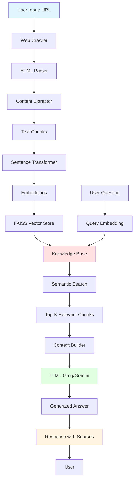

# 🤖 RAG Website Chatbot

A production-ready Retrieval-Augmented Generation (RAG) chatbot that can answer questions about any website. Simply provide a URL, and the chatbot will crawl the website, build a knowledge base, and answer your questions using AI.

## ✨ Features

- 🕷️ **Intelligent Web Crawling**: Crawls websites up to 2 levels deep with robots.txt compliance
- 🧠 **Smart Knowledge Base**: Uses sentence transformers and FAISS for semantic search
- 💬 **Natural Conversations**: Powered by Groq (Llama 3.1 70B) with Google Gemini fallback
- 📚 **Source Citations**: Every answer includes references to source pages
- 🎨 **Beautiful UI**: Clean, intuitive Streamlit interface
- ⚡ **Fast & Efficient**: Processes websites in minutes, answers in seconds
- 🔒 **Safe & Respectful**: Rate limiting, robots.txt compliance, and error handling

## 🏗️ Architecture



## 🛠️ Technology Stack

| Component | Technology |
|-----------|-----------|
| **Web Framework** | Streamlit |
| **Web Crawling** | BeautifulSoup4, Requests |
| **Embeddings** | Sentence Transformers (all-MiniLM-L6-v2) |
| **Vector Store** | FAISS |
| **LLM** | Groq (Llama 3.1 70B) with Google Gemini fallback |
| **Text Processing** | LangChain |
| **Language** | Python 3.8+ |

## 📦 Installation

### Prerequisites
- Python 3.8 or higher
- Groq API key (required)
- Google API key (optional, for fallback)

### Steps

1. **Clone the repository**
```bash
git clone https://github.com/sanket-shitole/rag-website-chatbot.git
cd rag-website-chatbot
```

2. **Install dependencies**
```bash
pip install -r requirements.txt
```

3. **Set up environment variables**
```bash
cp .env.example .env
```

Edit `.env` and add your API keys:
```
GROQ_API_KEY=your_groq_api_key_here
GOOGLE_API_KEY=your_google_api_key_here  # Optional
```

4. **Run the application**
```bash
streamlit run app.py
```

The application will open in your browser at `http://localhost:8501`

## 🚀 Usage Guide

### Step 1: Enter Website URL
1. Open the application in your browser
2. Enter the URL of the website you want to learn about (e.g., `https://python.org`)
3. Optionally adjust advanced settings:
   - **Max Crawl Depth**: How many levels deep to crawl (1-3)
   - **Max Pages**: Maximum pages to crawl (10-100)
   - **Chunk Size**: Size of text chunks for processing (500-2000)
   - **Chunk Overlap**: Overlap between chunks (50-500)

### Step 2: Build Knowledge Base
1. Click "🕷️ Crawl & Build Knowledge Base"
2. Wait while the system:
   - Crawls the website
   - Extracts and processes content
   - Creates embeddings
   - Builds the vector store
3. View the statistics showing pages crawled and chunks created

### Step 3: Ask Questions
1. Type your question in the input box
2. Click "📤 Send" or press Enter
3. View the AI-generated answer with source citations
4. Click "📚 View Sources" to see the exact pages used

### Step 4: Continue Conversation
- Ask follow-up questions
- The chatbot maintains context from previous messages
- Use "🗑️ Clear Chat History" to start fresh
- Use "🔄 Reset Knowledge Base" to crawl a different website

## 💡 Example Queries

Here are some example questions you can ask:

1. **General Overview**: "What is this website about?"
2. **Specific Information**: "What are the main features of this product?"
3. **Technical Details**: "What programming languages are mentioned?"
4. **Comparison**: "What are the differences between the pricing plans?"
5. **How-to**: "How do I get started with this service?"

**Example Output:**
```
Question: "What is Python used for?"

Answer: Based on the content from python.org, Python is a versatile 
programming language used for web development, data analysis, artificial 
intelligence, scientific computing, and automation. It's known for its 
simple syntax and extensive library ecosystem.

Sources:
1. About Python - https://www.python.org/about/
2. Python Applications - https://www.python.org/about/apps/
```

## 🔍 How It Works

### 1. Web Crawling Process
- **URL Validation**: Validates and normalizes the input URL
- **Robots.txt Compliance**: Checks and respects robots.txt rules
- **Depth-First Crawling**: Crawls pages up to specified depth
- **Content Extraction**: Extracts titles, headings, paragraphs, and text
- **Deduplication**: Tracks visited URLs to avoid cycles
- **Rate Limiting**: Waits 1 second between requests
- **Error Handling**: Gracefully handles timeouts and errors

### 2. Knowledge Base Construction
- **Text Preprocessing**: Cleans HTML entities and normalizes text
- **Chunking**: Splits text into 1000-character chunks with 200-char overlap
- **Embedding Creation**: Converts text to 384-dimensional vectors using Sentence Transformers
- **Vector Indexing**: Stores embeddings in FAISS index for fast similarity search
- **Metadata Storage**: Preserves source URL, title, and chunk index

### 3. RAG Pipeline
- **Query Processing**: Converts user question to embedding vector
- **Semantic Search**: Finds top-5 most relevant chunks using cosine similarity
- **Context Construction**: Formats retrieved chunks with source information
- **Prompt Engineering**: Creates optimized prompt for LLM
- **Answer Generation**: Uses Groq API (Llama 3.1 70B) to generate response
- **Source Citation**: Returns answer with source URLs and relevance scores

## ⚠️ Limitations

- **JavaScript-Heavy Sites**: May not capture dynamically loaded content
- **Large Websites**: Limited to 50 pages by default to prevent overload
- **Rate Limiting**: 1-second delay between requests may slow down large crawls
- **Crawling Restrictions**: Respects robots.txt and may skip blocked pages
- **Authentication**: Cannot access password-protected content
- **PDF/Documents**: Only processes HTML content, not PDFs or documents
- **Real-time Data**: Creates a snapshot; doesn't update automatically

## 🔮 Future Enhancements

- [ ] **Multi-URL Support**: Process multiple websites simultaneously
- [ ] **PDF/Document Support**: Extract content from PDFs and documents
- [ ] **Advanced Chunking**: Implement semantic chunking strategies
- [ ] **User Authentication**: Add user accounts and access control
- [ ] **Chat History Persistence**: Save and load previous conversations
- [ ] **Export Conversations**: Download chat history as text/JSON
- [ ] **Feedback System**: Thumbs up/down for answer quality
- [ ] **Custom Embeddings**: Support for different embedding models
- [ ] **API Endpoint**: RESTful API for programmatic access
- [ ] **Multilingual Support**: Handle non-English websites

## 🔑 API Keys Setup

### Get Groq API Key (Required)
1. Go to [Groq Console](https://console.groq.com/)
2. Sign up for a free account
3. Navigate to API Keys section
4. Create a new API key
5. Copy the key and add it to your `.env` file

### Get Google API Key (Optional)
1. Go to [Google AI Studio](https://makersuite.google.com/app/apikey)
2. Sign in with your Google account
3. Create a new API key
4. Copy the key and add it to your `.env` file

## 🌐 Deployment

### Deploy to Streamlit Cloud

1. **Push to GitHub**
```bash
git add .
git commit -m "Initial commit"
git push origin main
```

2. **Deploy on Streamlit Cloud**
   - Go to [share.streamlit.io](https://share.streamlit.io)
   - Click "New app"
   - Select your repository
   - Set main file path: `app.py`
   - Add secrets in "Advanced settings":
     ```
     GROQ_API_KEY = "your_key_here"
     GOOGLE_API_KEY = "your_key_here"
     ```
   - Click "Deploy"

3. **Access Your App**
   - Your app will be available at: `https://your-app-name.streamlit.app`

### Deploy to Other Platforms
- **Heroku**: Use `Procfile` with `web: streamlit run app.py`
- **AWS/GCP**: Use Docker container with Streamlit
- **Local Server**: Run with `streamlit run app.py --server.port 8080`

## 🐛 Troubleshooting

### Issue: "GROQ_API_KEY not found"
**Solution**: Make sure you've created a `.env` file and added your API key

### Issue: "No content extracted from website"
**Solution**: 
- Check if the URL is correct and accessible
- Website may be blocking crawlers
- Try a different website

### Issue: "Error generating answer"
**Solution**:
- Check your internet connection
- Verify API keys are valid
- Try using Google API key as fallback

### Issue: "ModuleNotFoundError"
**Solution**: Reinstall dependencies: `pip install -r requirements.txt`

### Issue: Slow crawling
**Solution**: 
- Reduce max pages in settings
- Reduce max depth to 1
- Some websites may have rate limiting

## 🤝 Contributing

Contributions are welcome! Here's how you can help:

1. Fork the repository
2. Create a feature branch (`git checkout -b feature/AmazingFeature`)
3. Commit your changes (`git commit -m 'Add some AmazingFeature'`)
4. Push to the branch (`git push origin feature/AmazingFeature`)
5. Open a Pull Request

**Areas for Contribution:**
- Bug fixes and improvements
- New features from the roadmap
- Documentation improvements
- Test coverage
- UI/UX enhancements

## 📄 License

This project is licensed under the MIT License - see below for details:

```
MIT License

Copyright (c) 2024 Sanket Shitole

Permission is hereby granted, free of charge, to any person obtaining a copy
of this software and associated documentation files (the "Software"), to deal
in the Software without restriction, including without limitation the rights
to use, copy, modify, merge, publish, distribute, sublicense, and/or sell
copies of the Software, and to permit persons to whom the Software is
furnished to do so, subject to the following conditions:

The above copyright notice and this permission notice shall be included in all
copies or substantial portions of the Software.

THE SOFTWARE IS PROVIDED "AS IS", WITHOUT WARRANTY OF ANY KIND, EXPRESS OR
IMPLIED, INCLUDING BUT NOT LIMITED TO THE WARRANTIES OF MERCHANTABILITY,
FITNESS FOR A PARTICULAR PURPOSE AND NONINFRINGEMENT. IN NO EVENT SHALL THE
AUTHORS OR COPYRIGHT HOLDERS BE LIABLE FOR ANY CLAIM, DAMAGES OR OTHER
LIABILITY, WHETHER IN AN ACTION OF CONTRACT, TORT OR OTHERWISE, ARISING FROM,
OUT OF OR IN CONNECTION WITH THE SOFTWARE OR THE USE OR OTHER DEALINGS IN THE
SOFTWARE.
```

## 👏 Acknowledgments

- [Streamlit](https://streamlit.io/) for the amazing web framework
- [Groq](https://groq.com/) for fast LLM inference
- [Sentence Transformers](https://www.sbert.net/) for embeddings
- [FAISS](https://github.com/facebookresearch/faiss) for vector similarity search
- [LangChain](https://langchain.com/) for RAG utilities

## 📞 Contact

- **Author**: Sanket Shitole
- **GitHub**: [@sanket-shitole](https://github.com/sanket-shitole)
- **Repository**: [rag-website-chatbot](https://github.com/sanket-shitole/rag-website-chatbot)

## ⭐ Star History

If you find this project useful, please consider giving it a star! It helps others discover the project.

---

**Built with ❤️ using Python, Streamlit, and AI**
